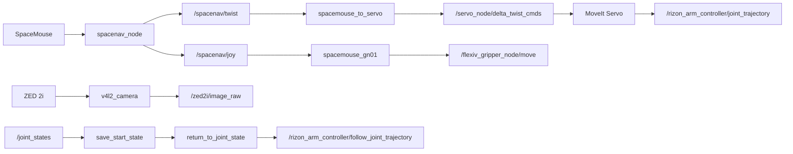

# Flexiv SpaceMouse Teleop

[](https://docs.ros.org/en/humble/)
[](https://releases.ubuntu.com/22.04/)
[](https://moveit.picknik.ai/)
[](LICENSE)

SpaceMouse teleoperation bridge for Flexiv Rizon arms using ROS 2 Humble,
`flexiv_ros2`, and MoveIt Servo.

This repository is intentionally small: it does not vendor Flexiv SDKs or robot
descriptions. Clone it into a ROS 2 workspace that already contains
`flexiv_ros2` `humble-v1.7`, then use a SpaceMouse to stream Cartesian twist
commands into MoveIt Servo and map SpaceMouse buttons to the Flexiv-GN01
gripper.

## What This Gives You

- 6-DoF SpaceMouse input via `spacenavd` and `ros-humble-spacenav`
- `geometry_msgs/TwistStamped` bridge into `/servo_node/delta_twist_cmds`
- Deadman button gating: by default, hold SpaceMouse button `0` before motion
  commands are forwarded
- Optional Flexiv-GN01 button bridge: SpaceMouse button `1` toggles close/open
- ZED 2i fixed RGB publishing through the standard ROS `v4l2_camera` driver
- Session restore tools that save the start joint state and optionally return to it
- Lab-friendly scripts for fake hardware, real hardware, servo start, recording,
  and environment checks
- A full operator manual for new lab members and robotics researchers

## Tested Stack

| Component | Version / configuration |
| --- | --- |
| OS | Ubuntu 22.04.5 LTS |
| ROS | ROS 2 Humble |
| Robot stack | `flexiv_ros2` `humble-v1.7` |
| Robot target | Flexiv Rizon 4s / RDK-compatible v3.9 stack |
| Input device | 3Dconnexion SpaceMouse through `spacenavd` |
| Camera | ZED 2i as USB3 V4L2 RGB stream |
| Servoing | MoveIt Servo `servo_node_main` |

Other Rizon models supported by `flexiv_ros2` may work after changing
`RIZON_TYPE` and `ROBOT_SN`.

## Quick Start

On the Ubuntu owner machine:

```bash
mkdir -p ~/teleop_ws/src
cd ~/teleop_ws/src

git clone --recurse-submodules --branch humble-v1.7 --depth 1 \
  https://github.com/flexivrobotics/flexiv_ros2.git

git clone https://github.com/ZihaoLu001/flexiv-spacemouse-teleop.git
cd ~/teleop_ws

sudo apt update
sudo apt install -y \
  spacenavd libspnav-dev ros-humble-spacenav \
  v4l-utils ros-humble-v4l2-camera ros-humble-image-view \
  ros-humble-image-transport-plugins
rosdep update
rosdep install --from-paths src --ignore-src --rosdistro humble -r -y
```

Build the Flexiv RDK dependency first, then build the workspace:

```bash
cd ~/teleop_ws/src/flexiv_ros2/flexiv_hardware/rdk/thirdparty
bash build_and_install_dependencies.sh ~/rdk_install

cd ~/teleop_ws/src/flexiv_ros2/flexiv_hardware/rdk
rm -rf build && mkdir build && cd build
cmake .. -DCMAKE_INSTALL_PREFIX=~/rdk_install
cmake --build . --target install --config Release -j"$(nproc)"

cd ~/teleop_ws
source /opt/ros/humble/setup.bash
colcon build --symlink-install --cmake-args -DCMAKE_PREFIX_PATH=~/rdk_install
source install/setup.bash
```

Run fake hardware first:

```bash
~/teleop_ws/src/flexiv-spacemouse-teleop/scripts/run_fake_moveit_servo.sh
```

In a second terminal:

```bash
~/teleop_ws/src/flexiv-spacemouse-teleop/scripts/start_servo.sh
~/teleop_ws/src/flexiv-spacemouse-teleop/scripts/run_spacemouse_bridge.sh enable_gripper:=false
```

By default the bridge is armed only while SpaceMouse button `0` is held. Release
that button and the bridge publishes zero twist.

When gripper support is enabled, button `0` remains the motion deadman and
button `1` toggles GN01 close/open.

Start the ZED 2i fixed RGB stream in another terminal:

```bash
~/teleop_ws/src/flexiv-spacemouse-teleop/scripts/run_zed_rgb_camera.sh
```

It publishes `/zed2i/image_raw` and `/zed2i/camera_info`.

Before moving the arm, save the session start state:

```bash
STATE_FILE=$(~/teleop_ws/src/flexiv-spacemouse-teleop/scripts/save_start_state.sh)
echo "$STATE_FILE"
```

At the end of teleoperation, return to that pose before shutting down:

```bash
~/teleop_ws/src/flexiv-spacemouse-teleop/scripts/restore_start_state.sh "$STATE_FILE"
~/teleop_ws/src/flexiv-spacemouse-teleop/scripts/restore_start_state.sh "$STATE_FILE" --execute
~/teleop_ws/src/flexiv-spacemouse-teleop/scripts/stop_ros_stack.sh
```

The restore command moves the robot, so it requires the explicit `--execute`
flag. Without that flag it only prints a dry-run summary. It also refuses large
joint deltas or fast implied return speeds unless `--force` is explicitly used.
Before sending the return trajectory, the script stops `/servo_node` so live
teleoperation commands cannot overwrite the return goal. After the action
reports success, it checks `/joint_states` and fails if the final joint error is
larger than the configured tolerance.

For real hardware, read the safety checklist first:

- [Project website](https://zihaolu001.github.io/flexiv-spacemouse-teleop/)
- [Operator manual](https://zihaolu001.github.io/flexiv-spacemouse-teleop/operator-manual.html)
- [Safety checklist](https://zihaolu001.github.io/flexiv-spacemouse-teleop/safety.html)
- [Troubleshooting guide](https://zihaolu001.github.io/flexiv-spacemouse-teleop/troubleshooting.html)
- [Chinese lab quickstart](https://zihaolu001.github.io/flexiv-spacemouse-teleop/lab-quickstart-zh.html)

## Runtime Graph



## Repository Layout

```text
flexiv_spacemouse_teleop/     ROS 2 Python nodes
launch/                       ROS launch file
config/                       Default teleop parameters
scripts/                      Lab and operator helper scripts
docs/                         Manual, safety notes, and static website
.github/workflows/            Lightweight syntax smoke checks
```

## Safety

This package streams motion commands to a physical robot. Use fake hardware
before real hardware, keep the emergency stop reachable, set conservative speed
scales, and verify axis signs away from people and fragile objects.

The default bridge clamps unitless Servo commands to `[-1, 1]` and publishes
zero commands if SpaceMouse input becomes stale or the deadman button is not
held. These protections are helpful, but they are not a substitute for a trained
operator.

## Citation

If this helps your lab or paper infrastructure, cite the repository:

```bibtex
@software{lu_flexiv_spacemouse_teleop_2026,
  author = {Lu, Zihao},
  title = {Flexiv SpaceMouse Teleop},
  year = {2026},
  url = {https://github.com/ZihaoLu001/flexiv-spacemouse-teleop}
}
```

## Acknowledgements

This project builds on Flexiv's `flexiv_ros2`, ROS 2 Humble, MoveIt Servo, and
the FreeSpacenav userspace driver ecosystem. It is not affiliated with Flexiv,
OpenAI, 3Dconnexion, or the MoveIt maintainers.
