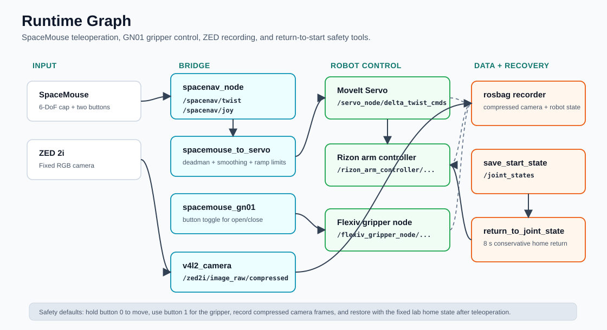

# Flexiv SpaceMouse Teleop

[](https://github.com/ZihaoLu001/flexiv-spacemouse-teleop/actions/workflows/ci.yml)
[](https://docs.ros.org/en/humble/)
[](https://releases.ubuntu.com/22.04/)
[](https://moveit.picknik.ai/)
[](LICENSE)

SpaceMouse teleoperation bridge for Flexiv Rizon arms using ROS 2 Humble,
`flexiv_ros2`, and MoveIt Servo.

This repository is intentionally small: it does not vendor Flexiv SDKs or robot
descriptions. It lives in a ROS 2 workspace next to `flexiv_ros2`
`humble-v1.7`, streams 6-DoF SpaceMouse input into MoveIt Servo as Cartesian
twist commands, and maps SpaceMouse buttons to the Flexiv-GN01 gripper.

## One-Command Quick Start

After [installation](docs/INSTALL.md), one command starts the whole stack
(flexiv_ros2 driver + MoveIt Servo + spacenav + bridges), enables Servo, and
tears everything down again on `Ctrl-C`:

```bash
# Fake hardware — no robot needed, safe anywhere:
scripts/teleop.sh

# Real robot (explicit serial number required):
ROBOT_SN=Rizon4s-062626 scripts/teleop.sh --real
```

Hold SpaceMouse button `0` (left) as the deadman to move the arm; press button
`1` (right) to toggle the GN01 gripper. `Ctrl-C` stops teleoperation and shuts
the whole ROS stack down.

Useful flags (see `scripts/teleop.sh --help`):

| Flag | Effect |
| --- | --- |
| `--real` / `--fake` | Real robot / fake hardware (default fake) |
| `--no-gripper` | Skip the gripper model and button bridge |
| `--camera` | Also start the ZED 2i RGB stream |
| `--record` | Also record a demo rosbag (robot topics must exist) |
| `--keep-stack` | Leave the robot stack running when the script exits |

Logs for each run land in `~/teleop_logs/<timestamp>/` (`stack.log`,
`bridge.log`, plus `camera.log` / `record.log` when enabled).

Before the first real-robot run, read [docs/SAFETY.md](docs/SAFETY.md) and run
`scripts/doctor.sh` — it exits non-zero and prints `PROBLEM:` lines when
anything is misconfigured.

## Tested Stack

| Component | Version / configuration |
| --- | --- |
| OS | Ubuntu 22.04.5 LTS |
| ROS | ROS 2 Humble |
| Robot stack | `flexiv_ros2` `humble-v1.7` |
| Robot | Flexiv Rizon 4s, robot software v1.7 |
| Flexiv RDK (Python) | `flexivrdk==1.7.0` — must pair exactly with robot software v1.7 |
| Input device | 3Dconnexion SpaceMouse through `spacenavd` |
| Camera | ZED 2i as USB3 V4L2 stream (2560x720 side-by-side HD720) |
| Servoing | MoveIt Servo `servo_node_main` |

Other Rizon models supported by `flexiv_ros2` may work after changing
`RIZON_TYPE` and `ROBOT_SN`.

## What This Gives You

- One-command startup and clean shutdown of the full teleop stack
  (`scripts/teleop.sh`)
- 6-DoF SpaceMouse input via `spacenavd` and `ros-humble-spacenav`
- `geometry_msgs/TwistStamped` bridge into `/servo_node/delta_twist_cmds` with
  deadband, per-axis scaling, clamping, smoothing, and slew limiting
- Deadman gating: motion is forwarded only while SpaceMouse button `0` is held
- Flexiv-GN01 button bridge: button `1` rising edge toggles open/close
  (0.09 m / 0.01 m)
- A version-controlled MoveIt Servo configuration
  (`config/rizon_moveit_servo_config.lab.yaml`) installed and verified by
  `scripts/apply_servo_config.sh` — no more hand-edits of the vendored
  `flexiv_ros2` tree
- ZED 2i RGB publishing through the standard ROS `v4l2_camera` driver
- Session tools that save the start joint state and return to it
  (dry-run by default, Servo stopped automatically before restore)
- Demo recording with topic-existence checks and per-run metadata
- `scripts/doctor.sh` environment checks that fail loudly

## Architecture

<p align="center">
  
</p>

The graph is checked in as static SVG so the GitHub README does not depend on
Mermaid rich-display availability.

## Servo Config Management

`flexiv_bringup` loads MoveIt Servo's configuration from a file inside the
`flexiv_ros2` checkout. This repo used to `sed`/hand-edit that file, which is
exactly how unrecorded safety drift happens (at one point collision checking
was silently disabled on the lab machine). Now:

- `config/rizon_moveit_servo_config.lab.yaml` is the single source of truth,
  version-controlled here with a header comment documenting every delta from
  the upstream `flexiv_ros2` defaults and why it exists.
- `config/grav.srdf.lab.xacro` is the GN01 gripper SRDF with the
  gripper-internal collision pairs excluded. Upstream misses them, and since
  the finger tips legally touch at width 0, Servo's proximity check otherwise
  reports "Close to a collision, decelerating" whenever the gripper is closed —
  the very false alarm that once led to collision checking being disabled.
  With this SRDF, `check_collisions: true` runs with zero false positives
  (verified end-to-end on fake hardware).
- `scripts/apply_servo_config.sh` installs both files into the `flexiv_ros2`
  checkout (backing up the previous ones), `--check` verifies the installed
  copies match byte-for-byte, and `--restore` puts back the pristine upstream
  files.
- `scripts/teleop.sh` auto-installs the config if it drifted; `scripts/doctor.sh`
  and `scripts/run_real_moveit_servo.sh` verify the safety-relevant keys.

Key settings (see the YAML header for the full rationale):

- `check_collisions: true` — the upstream default, kept on. The known false
  trigger (closed GN01 fingers) is fixed by the repo-managed SRDF above; if a
  new false trigger appears, extend the SRDF collision matrix — do not turn
  the feature off.
- `ee_frame_name: <sn>_grav_tcp` — the official GN01 open-finger TCP. This
  frame only exists when `load_gripper:=true`; the run scripts refuse to start
  otherwise.
- `robot_link_command_frame: <sn>_base_link` — teleop twists are interpreted in
  the robot **base** frame. The `sign_*` values in
  `config/spacemouse_teleop.yaml` are calibrated for this frame; re-calibrate
  them if you change the command frame.
- `publish_period: 0.02` (50 Hz) and `joint_topic: /flexiv_arm/joint_states`
  (the high-rate arm stream; the aggregated `/joint_states` is only ~30 Hz).

Never hand-edit the Servo config inside `flexiv_ros2`. Edit
`config/rizon_moveit_servo_config.lab.yaml` here and re-run
`scripts/apply_servo_config.sh` so the change is recorded and reviewable.

## Manual Step-by-Step (Advanced)

`scripts/teleop.sh` is a thin orchestrator over per-piece scripts you can still
run in separate terminals when debugging:

```bash
# Terminal 1: robot stack + Servo (fake or real)
scripts/run_fake_moveit_servo.sh
# or: ROBOT_SN=Rizon4s-062626 scripts/run_real_moveit_servo.sh

# Terminal 2: enable Servo, then start the SpaceMouse bridges
scripts/start_servo.sh
scripts/run_spacemouse_bridge.sh enable_gripper:=false

# Optional extras
scripts/run_zed_rgb_camera.sh
ROBOT_SN=Rizon4s-062626 scripts/record_demo.sh

# Shutdown
scripts/stop_ros_stack.sh
```

See [docs/OPERATOR_MANUAL.md](docs/OPERATOR_MANUAL.md) for the full manual
procedure, session save/restore, and the real-hardware checklist, including the
one-time GN01 gripper initialization (`scripts/init_gn01_once.py`, which must
run while the ROS stack is stopped — the robot accepts a single RDK
connection).

## Tuning

All bridge parameters live in `config/spacemouse_teleop.yaml`, which is the
single source of truth — the launch file no longer overrides YAML values with
launch-argument defaults. After editing the YAML there is nothing to recompile:
with a `--symlink-install` build (the default in `scripts/build_workspace.sh`),
restarting the launch (or `teleop.sh`) picks up the change.

The default profile is intentionally smooth, ramp-limited, and deadman-gated:

- Servo consumes unitless joystick-style commands; the bridge clamps its
  output to `clamp_abs: 0.62` (the node's built-in default is `0.75`).
- Servo maps unitless commands with `scale.linear: 0.4` m/s and
  `scale.rotational: 0.8` rad/s, so the default `linear_scale: 0.32` maps full
  SpaceMouse deflection to about 0.13 m/s.
- The lateral axis uses `linear_y_scale: 0.45` after lab testing showed that
  higher gains made grasping demos visibly jitter.
- `sign_*` values flip axis directions. They are calibrated for commands
  interpreted in the robot **base** frame
  (`robot_link_command_frame` in the Servo config); re-calibrate after any
  command-frame change.
- `publish_when_idle: true` (default) keeps publishing zero twists at 50 Hz
  while idle, so Servo stays active and holds position — and keeps ownership of
  the arm controller. Any parallel motion command (e.g. a MoveIt plan) will be
  overridden while the bridge is running; stop Servo first
  (`scripts/restore_start_state.sh` does this automatically). Set it to `false`
  to release the controller when no motion is commanded.

## Safety

This package streams motion commands to a physical robot. Use fake hardware
before real hardware, keep the emergency stop reachable, set conservative speed
scales, and verify axis signs away from people and fragile objects.

The bridge clamps commands (`clamp_abs: 0.62` by default) and publishes zero
twist when input goes stale or the deadman button is released; Servo performs
collision checking (`check_collisions: true`). These protections are helpful,
but they are not a substitute for a trained operator. Read
[docs/SAFETY.md](docs/SAFETY.md) — including the E-stop recovery procedure —
before any real-robot session.

## Documentation

- [Installation](docs/INSTALL.md)
- [Operator manual](docs/OPERATOR_MANUAL.md)
- [Safety checklist](docs/SAFETY.md)
- [Troubleshooting](docs/TROUBLESHOOTING.md)
- [Research workflow](docs/RESEARCH_WORKFLOW.md)
- [中文实验室快速手册](docs/LAB_QUICKSTART_zh.md)

## Repository Layout

```text
flexiv_spacemouse_teleop/     ROS 2 Python nodes
launch/                       ROS launch files
config/                       Teleop parameters + versioned Servo config
scripts/                      teleop.sh and per-piece operator scripts
tests/                        Unit tests for the bridge logic
docs/                         Manuals, safety notes, landing page
.github/workflows/            CI: package build, unit tests, syntax checks
```

## Citation

If this helps your lab or paper infrastructure, cite the repository:

```bibtex
@software{lu_flexiv_spacemouse_teleop_2026,
  author = {Lu, Zihao},
  title = {Flexiv SpaceMouse Teleop},
  year = {2026},
  url = {https://github.com/ZihaoLu001/flexiv-spacemouse-teleop}
}
```

## Acknowledgements

This project builds on Flexiv's `flexiv_ros2`, ROS 2 Humble, MoveIt Servo, and
the FreeSpacenav userspace driver ecosystem. It is not affiliated with Flexiv,
3Dconnexion, or the MoveIt maintainers.
